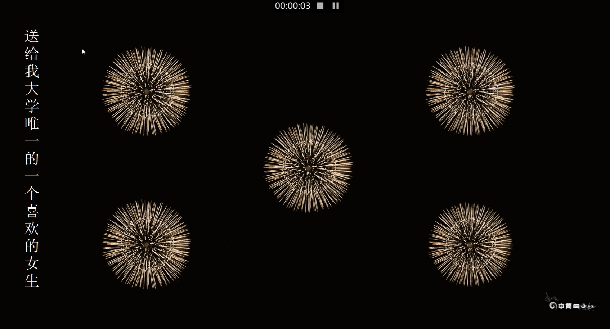

# flowers
基于Qt widget (cpp)的一个表白动画程序

<iframe
    width="800" 
    height="450" 
    src="./mp4/screen_recording.mp4"
 	frameborder="0" 
    allowfullscreen>
</iframe>

- exe/flowers.exe 为编译好可直接在windows平台下运行的可执行程序
- mp4/screen_recording.mp4 为运行效果的录屏
- images/ mp3/ 为该工程需要用到的素材

<video id="video" controls="" preload="none" poster="screenshot/screenshot.png">
      <source id="mp4" src="mp4/screen_recording.mp4" type="video/mp4">
</video>